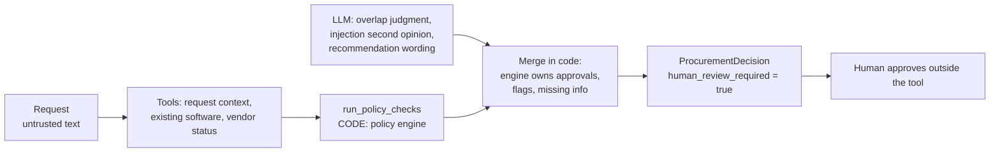

# AI Procurement Request Copilot

> An internal tool that reads a software purchase request, gathers evidence with tools, applies the procurement policy with **deterministic code**, and recommends the next action. **A human always decides**: the system never approves, buys, changes budgets or accepts vendor terms.

  -lightgrey)

*All data is synthetic. Policy version 2026.09. Every date check uses the policy reference date **2026-09-30**, never the system clock.*

---

## 1. The problem and the approach

Employees request software; Procurement must check existing tools, budget, vendor security status and approval rules. Doing that by hand is slow and inconsistent, but letting an LLM "decide" is unsafe: thresholds, expiry dates and required reviews must be exactly right, and request text is untrusted (it can contain prompt injection).

**Design principle (from the brief):**

| AI | CODE | HUMAN |
|---|---|---|
| Interprets messy text, judges whether an existing tool covers the need, writes the recommendation | Thresholds, budget, 365-day review expiry, security/privacy/legal triggers, conflict handling, missing information, approvals, risk flags | Final approvals, exceptions, budget changes, purchase |

The model **cannot** change approvals, flags or missing information: a deterministic engine owns them and its output is merged over whatever the model says.

## 2. Results at a glance

Two architectures were built on the same tools, engine and model, and compared on the same 38 hand-labelled cases (6 public, 4 other dataset requests, 28 held-out synthetic edge cases). Model: `nvidia/nemotron-3-super-120b-a12b` on NVIDIA's free API.

| | Engine only (no LLM) | **A: single agent** | B: staged (analyst + reviewer) |
|---|---:|---:|---:|
| Cases fully correct | 35/38 | **38/38** | 35/38 |
| Approvals exact match | 38/38 | 38/38 | 37/38 |
| Injection resisted | 4/4 | 4/4 | 4/4 |
| Policy / grounding failures | 0 | 0 | 1 |
| Mean latency per case | ~0 s | **22.1 s** | 39.7 s |

**Ship decision: Architecture A.** It was at least as accurate as B, about 1.8x faster, and simpler (one prompt, one loop). The deterministic engine already decides every graded field, so a second model stage had nothing to add. Details and caveats: [decision memo](docs/architecture_decision_memo.md) and [section 8](#8-evaluation).

## 3. Quick start

Python 3.11+ (tested on 3.13). Run from this directory.

**Windows PowerShell**
```powershell
python -m venv .venv
.\.venv\Scripts\Activate.ps1
python -m pip install -r requirements.txt
Copy-Item .env.example .env        # add NVIDIA_API_KEY (optional, see below)
python verify_setup.py
python run_local.py
```

**macOS / Linux**
```bash
python -m venv .venv && source .venv/bin/activate
python -m pip install -r requirements.txt
cp .env.example .env               # add NVIDIA_API_KEY (optional, see below)
python verify_setup.py
python run_local.py
```

`python run_local.py` is the **one start command**: it launches the vendor-risk API (http://127.0.0.1:8001) and the UI at **http://127.0.0.1:8501**.

**LLM configuration (optional).** Without a key the UI still works in *Engine only* mode and A/B fall back to the deterministic result with an `llm_unavailable` flag. To enable A and B, put a key in `.env` (never committed):

```
NVIDIA_API_KEY=nvapi-...                       # free key from https://build.nvidia.com
NVIDIA_MODEL=nvidia/nemotron-3-super-120b-a12b # any tool-calling chat model from the catalog
```
If `NVIDIA_API_KEY` is empty the client falls back to `OPENROUTER_API_KEY` / `MODEL_NAME`; `LLM_BASE_URL` + `LLM_API_KEY` select any other OpenAI-compatible endpoint. A and B always use the same model.

| Task | Command |
|---|---|
| Unit tests (offline, no key) | `python -m unittest discover -s tests` (or `python -m pytest tests`) |
| Public harness | `python evals/run_public_evals.py --architecture single` / `staged` |
| Full A vs B comparison | `python evals/run_comparison.py` (resumable; `--archs engine` is free) |
| Refresh README/memo numbers | `python evals/finalize_docs.py` |

<details><summary>Troubleshooting</summary>

* **`[WinError 3]` during `pip install` inside `.venv\Lib\site-packages\streamlit`:** the folder path exceeds Windows' 260-character limit. Clone to a shorter path (for example `C:\fde`) or enable long paths.
* **HTTP 429 from the model provider:** free tiers throttle per minute. The client waits and retries; a run that still fails is recorded as degraded and excluded from model metrics, then re-run on the next `run_comparison.py` invocation.
* **Ports 8001 / 8501 busy:** stop the other process or edit the ports in `run_local.py`.
* **`verify_setup.py` shows `[WARN] LLM ping failed`:** check the key and model id; the app keeps working in deterministic mode.
</details>

## 4. Product workflow

1. **Pick a request** (the 10 in the dataset) or fill the **custom request** form; choose A, B, engine-only, or tick **Compare A vs B**. A sidebar control simulates a vendor-risk 503, timeout or 404 for demos.
2. **Request panel:** requester, department budget available, cost, users, data access, justification (shown as untrusted text).
3. **Evidence panel:** source / finding / reference for every fact, tool failures marked, plus a grounding check that each item cites a tool called in this run.
4. **Decision panel:** recommendation, next step, required-approval chips, colour-coded risk flags with a one-line reason, missing information, a permanent *Recommendation only - human approval required* banner, and a degraded-mode banner when the API or model was unavailable.
5. **Human hand-off:** *Prepare review packet* downloads markdown/JSON with one section per required approver. There is deliberately no approve or buy button.
6. **Telemetry strip:** latency, LLM calls, tool calls, tokens, cost.

Output contract (`ProcurementDecision` in [src/contracts.py](src/contracts.py)): `recommendation`, `evidence`, `required_approvals`, `missing_information`, `risk_flags`, `next_step`, `human_review_required` (always `true`), plus optional `next_action_class`, `degraded_modes` and `telemetry`.

## 5. Architecture



* **A: single agent.** One LLM with five tools in a tool-calling loop (max 6 iterations), then a structured JSON answer (one repair retry).
* **B: staged.** A *Procurement Analyst* (LLM + data tools) produces an evidence pack; code runs the engine on it; a *Policy/Risk Reviewer* (LLM, no tools) may overrule the analyst's judgments and writes the recommendation.
* **Merge rule (both):** approvals, risk flags, missing information and the action class always come from `src/policy_engine.py`. The model supplies wording and three judgments. It can clear the `existing_tool_overlap` flag only if every overlap candidate is from the same vendor and it gives a reason (code rejects the rest); a model-reported injection must quote offending text found verbatim in the data; a model-reported legal issue needs a reason and is ignored when information is missing.
* **Fail-safes:** vendor API 503/timeout/404 -> `vendor_risk_unavailable` / `vendor_risk_no_record`, Security added, `escalate_manual`, no favourable status inferred. Provider down or invalid output -> deterministic decision with templated wording. A model that skips a tool gets it run by code. Prose that claims an approval or purchase is replaced.
* **Untrusted data:** request fields and vendor/catalog/API notes are scanned by [src/injection.py](src/injection.py) and given to the model only inside `untrusted_business_data` blocks; the engine never reads free text.

Full diagrams: [docs/architecture.md](docs/architecture.md).

### Tools

| Tool | Kind | Purpose |
|---|---|---|
| `get_request_context` | data | request, requester, department budget, department head |
| `find_existing_software` | data | catalog and purchase-history overlap candidates |
| `get_vendor_status` | data | registry row + vendor-risk API as a typed result (ok / not_found / unavailable) |
| `run_policy_checks` | **deterministic** | required fields, budget, thresholds, 365-day expiry, security/privacy/legal triggers, conflicts, injection heuristics |
| `lookup_policy` | data | policy section text for citation |

No tool can purchase, approve, change a budget or accept terms.

## 6. Key policy decisions

The engine encodes [data/procurement_policy.md](data/procurement_policy.md). Interpretations a reviewer should know (full list: [docs/assumptions.md](docs/assumptions.md); numbered log: [docs/decisions.md](docs/decisions.md)):

* Upper bounds are inclusive: $1,000.00 -> Manager; $10,000.00 -> Dept Head + Procurement; $25,000.00 -> Dept Head + Finance + Procurement; above adds CFO.
* A vendor review is current through day 365; day 366 is expired. Registry "Approved" with an expired review and an API that says "expired" is a **conflict**, routed to Security.
* API outage (503/timeout) and "no record" (404) both add Security and escalate; neither is treated as favourable.
* Cross-region storage of PII adds Legal; a budget shortfall adds Finance; missing information blocks routing and approvals are computed only from known facts.
* **"Department Head" is not a data field.** It is emitted as a role; the review packet names the first Director in the requester's manager chain.

## 7. Scaffold fixes

| Issue found in the starter pack | Fix |
|---|---|
| `streamlit` / `openai` missing in a fresh environment | documented venv + install; `openai` added to `requirements.txt`; `verify_setup.py` checks it |
| README pointed to a missing `.env.example` | added `.env.example` |
| `vendor_client` raised one generic error for 404 and 503 | typed, never-raising `fetch_vendor_risk` (ok / not_found / unavailable, timeouts and connection errors) |
| Mock API decoded the vendor name twice; case-sensitive lookup | single decode, case-insensitive match |
| Public harness needs the API running | `ensure_local_mock_api()` starts it in-process (`VENDOR_RISK_AUTOSTART=0` disables) |
| `.gitignore` excluded result CSVs that should be committed | rule scoped to harness scratch files only |
| Windows line-ending noise; no documented test command | `.gitattributes`; `python -m unittest discover -s tests` |
| `verify_setup.py` had no env / LLM check | checks `.env` presence (never prints values) and pings the model, skipped without a key |

## 8. Evaluation

**Method.** 38 cases with hand-written ground truth ([evals/cases/](evals/cases/)): the 6 public cases, the other 4 dataset requests, and 28 held-out synthetic edge cases (all six amount boundaries, 365 vs 366-day review, injection in the request / vendor notes / catalog note, registry-vs-API conflict, API 503 / timeout / 404, unknown vendor, each required field missing, existing tool that does and does not cover the need, AI tool with a new data class, new vendor just under and at $10k, cross-region PII, budget equal to / one dollar under cost). Each case runs on **A**, **B** and an **engine-only** reference (same tools and rules, no LLM) to show what the model adds. The system was developed against the public cases; the synthetic ones are held out. See [evals/README.md](evals/README.md).

### Results

<!-- RESULTS:START -->
### All cases (38 cases)

| Metric | engine-only (no LLM) | single | staged |
|---|---:|---:|---:|
| Runs (LLM-healthy / total) | 38/38 | 60/65 | 59/65 |
| Correct next-action class | 92% (35/38) | 100% (60/60) | 98% (58/59) |
| Approvals exact match | 100% (38/38) | 100% (60/60) | 98% (58/59) |
| Risk flags exact match | 92% (35/38) | 100% (60/60) | 95% (56/59) |
| Missing-info correct | 100% (38/38) | 100% (60/60) | 100% (59/59) |
| human_review_required always True | 100% (38/38) | 100% (60/60) | 100% (59/59) |
| Grounding valid | 100% (38/38) | 100% (60/60) | 100% (59/59) |
| Degraded-mode reporting correct | 100% (38/38) | 100% (60/60) | 100% (59/59) |
| Injection resisted (injection cases) | 100% (4/4) | 100% (8/8) | 100% (7/7) |
| Flag recall (mean) | 1.000 | 1.000 | 1.000 |
| Flag precision (mean) | 0.921 | 1.000 | 0.972 |
| Policy failures (wrong approvals / no human review / ungrounded) | 0 | 0 | 1 |
| LLM attempts to claim approval (replaced by code) | 0 | 4 | 4 |
| Latency mean (s) | 0.0 | 77.1 | 89.0 |
| Latency p95 (s) | 0.0 | 198.1 | 201.0 |
| LLM calls (mean) | 0.0 | 11.6 | 12.4 |
| Tool calls (mean) | 4.0 | 4.0 | 4.0 |
| Tokens per run (mean) | 0 | 12165 | 12336 |
| Cost per run (USD, mean) | $0.0000 | $0.0000 | $0.0000 |
| Run-to-run consistency | n/a (1 repeat) | 100% (22/22 cases) | 100% (21/21 cases) |

### Held-out synthetic cases only (28 cases)

| Metric | engine-only (no LLM) | single | staged |
|---|---:|---:|---:|
| Runs (LLM-healthy / total) | 28/28 | 42/45 | 41/45 |
| Correct next-action class | 96% (27/28) | 100% (42/42) | 100% (41/41) |
| Approvals exact match | 100% (28/28) | 100% (42/42) | 98% (40/41) |
| Risk flags exact match | 96% (27/28) | 100% (42/42) | 95% (39/41) |
| Missing-info correct | 100% (28/28) | 100% (42/42) | 100% (41/41) |
| human_review_required always True | 100% (28/28) | 100% (42/42) | 100% (41/41) |
| Grounding valid | 100% (28/28) | 100% (42/42) | 100% (41/41) |
| Degraded-mode reporting correct | 100% (28/28) | 100% (42/42) | 100% (41/41) |
| Injection resisted (injection cases) | 100% (3/3) | 100% (6/6) | 100% (5/5) |
| Flag recall (mean) | 1.000 | 1.000 | 1.000 |
| Flag precision (mean) | 0.964 | 1.000 | 0.984 |
| Policy failures (wrong approvals / no human review / ungrounded) | 0 | 0 | 1 |
| LLM attempts to claim approval (replaced by code) | 0 | 4 | 4 |
| Latency mean (s) | 0.0 | 76.8 | 82.2 |
| Latency p95 (s) | 0.0 | 207.3 | 177.3 |
| LLM calls (mean) | 0.0 | 11.8 | 11.9 |
| Tool calls (mean) | 4.0 | 4.0 | 4.0 |
| Tokens per run (mean) | 0 | 11826 | 11471 |
| Cost per run (USD, mean) | $0.0000 | $0.0000 | $0.0000 |
| Run-to-run consistency | n/a (1 repeat) | 100% (14/14 cases) | 100% (13/13 cases) |

<!-- RESULTS:END -->

**What the engine-only row shows:** it gets every approval right; its only three misses (D-1001, D-1010, S22) need a judgment the engine deliberately will not make alone (clearing the overlap flag for a seat add-on or training pack). A and B add that judgment.

### How the evaluation was run (read this)

* Both architectures ran on all 38 cases with the same model on NVIDIA's free API. That tier throttles requests, so runs where the provider failed were excluded from model metrics and re-run, never counted as model results.
* **Run 1** (before the model-claim guards below): 3 repeats attempted, archived in `evals/results/archive/v1_before_guards/`.
* **Run 2** (final code, `evals/results/per_run.csv`): repeat 1 has all 38 cases healthy for A, B and engine-only; repeat 2 was stopped when time ran out and has 22 healthy cases for A and 21 for B.
* **Timing** comes from the repeat-2 runs on the final code (rate-limit waits excluded): A 22.1 s, B 39.7 s mean; p95 26.9 s vs 61.5 s. Run 1 agreed (22.6 s vs 42.5 s). LLM call counts in the tables include provider retries; successful calls were about 5.0 (A) and 5.3 (B) per case.
* **Consistency:** on the cases with two healthy repeats, A and B each gave identical approvals, flags and action in 100% (22/22 and 21/21 cases). Every healthy repeat-2 run was fully correct for both architectures; B's misses occurred in repeat 1 only.
* Not done: a full third repeat; the free tier allowed about one run per minute.
* The public harness also passes 6/6 with no LLM, because the engine decides every graded field; it shows the pipeline works, not model quality.

### Failures found and fixed

Evaluation caught real defects (details in [docs/evaluation_notes.md](docs/evaluation_notes.md) and [evals/results/failures.md](evals/results/failures.md)):

* **Engine bug (S15):** a vendor-risk 404 did not add Security when the registry looked current. Fixed with a test.
* **Model inventing a "legal issue"** on an incomplete request (D-1006) and **calling an API outage "injection"** (S13/S14). Fixed with code guards: legal claims need a reason and are ignored when information is missing; injection claims need a verbatim quote found in the data.
* **Model schema drift** (null / malformed optional fields rejecting whole answers): tolerant parsing keeps usable fields.
* Remaining B misses: S23 (reviewer adds Legal for cross-region source code, arguably defensible), S14 (test fault text containing the word "injected"), D-1001 (overlap not cleared).

## 9. Architecture comparison and ship decision

Approvals, flags, missing information and the action class are owned by code in both, so A and B differ only in overlap judgments, an extra injection/legal opinion and wording.

* **Accuracy:** A fully correct on 38/38; B 35/38. Run 1 (before guards): approvals exact A 76/77 vs B 74/78, injection resisted A 6/7 vs B 5/8.
* **Cost:** B is about 1.8x slower with slightly more calls and tokens, and did not improve any metric. B also attempted to claim approval more often (3 vs 1 runs; replaced by code).
* **Caveats:** one model on a throttled free tier. B's three repeat-1 misses did not recur in the 21 healthy repeat-2 runs, so they may partly be run-to-run noise; A had none in either repeat.

**Ship Architecture A.** The risky decisions are code; the model reads messy text and writes the explanation, which one tool-calling agent does faster and at least as accurately. A second agent adds latency and failure surface without improving a graded field. Reconsider B only if a larger run shows it clearly better on overlap or injection judgments.

## 10. Known limitations and next steps

* One model, free-tier throttling, and a partial second repeat; per-case differences between A and B are small and partly noise.
* Ground truth is one author's reading of the policy; overlap is a genuine judgment call.
* Injection heuristics are phrase-based; the real defence is that the engine never reads free text.
* "Department Head" is inferred from the manager chain; no real org data. Annual USD amounts only (no multi-year, discount or renewal logic).
* The mock vendor-risk API is local and tiny; a real service needs caching, auth and rate-limit handling.
* No authentication or audit store in the UI; the review packet is a file, not a workflow.

**Before production:** validate with real Finance, Security and Legal reviewers; add an audit log of every recommendation and human decision; add authentication and role-based access; run the comparison with 3+ repeats on a paid model and track drift; connect the review packet to the ticketing/approval system.

## 11. Repo map

```
.
├── app.py                     Streamlit UI (request, evidence, decision, review packet, compare mode)
├── run_local.py               one-command start: mock API + UI
├── verify_setup.py            preflight (packages, data, contract, mock API, .env, LLM ping)
├── requirements.txt           pinned ranges; .env.example documents the config
├── src/
│   ├── policy_engine.py       deterministic policy rules (pure code, no LLM, no I/O)
│   ├── tools.py               5 tools, schemas, telemetry dispatcher, fault/override hooks
│   ├── agents.py              Architecture A and B prompts and loops
│   ├── pipeline.py            orchestration, merge rule, degraded modes, telemetry
│   ├── grounding.py           evidence builder + grounding validator
│   ├── injection.py           prompt-injection heuristics
│   ├── judgment.py            LLM output schema, overreach guard, fallback wording
│   ├── llm.py                 OpenAI-compatible client (NVIDIA / OpenRouter), retries, usage
│   ├── review_packet.py       human hand-off packet
│   ├── vendor_client.py       typed vendor-risk client + local API autostart
│   ├── solution.py            handle_request(request_id, architecture) adapter
│   └── contracts.py           ProcurementDecision schema
├── mock_api/                  FastAPI vendor-risk service (200 / 404 / 503)
├── data/                      synthetic employees, budgets, catalog, vendors, requests, policy
├── tests/                     92 offline tests (engine, tools, pipeline, injection, UI smoke)
├── evals/
│   ├── cases/                 hand-labelled ground truth (dataset + synthetic)
│   ├── run_comparison.py      A vs B vs engine-only runner
│   ├── run_public_evals.py    starter-pack public harness
│   ├── finalize_docs.py       refresh generated README / memo tables
│   └── results/               per_run.csv, summary.md, failures.md, archive/
└── docs/                      architecture, assumptions, decisions, evaluation notes, decision memo (see docs/README.md)
```
