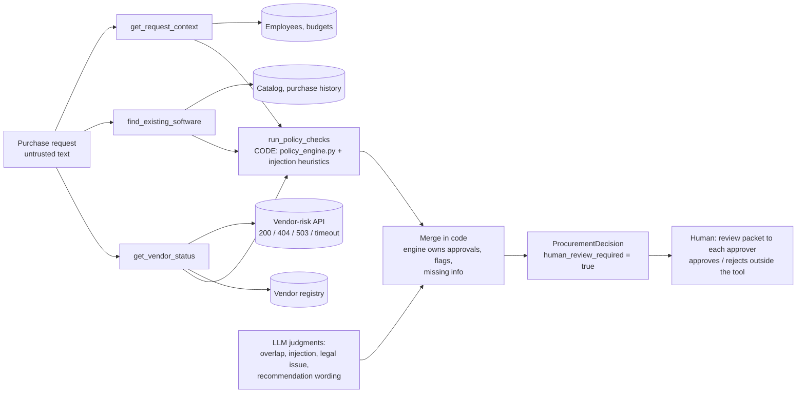
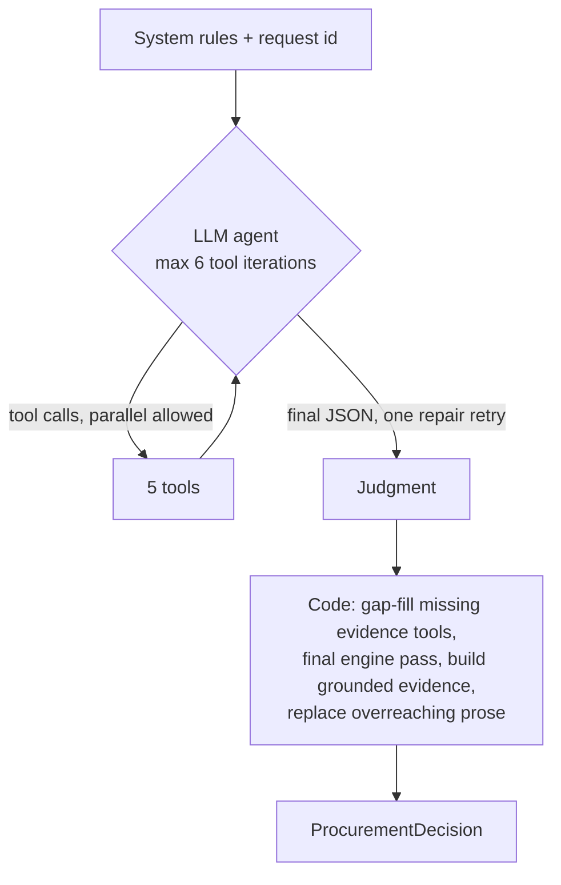
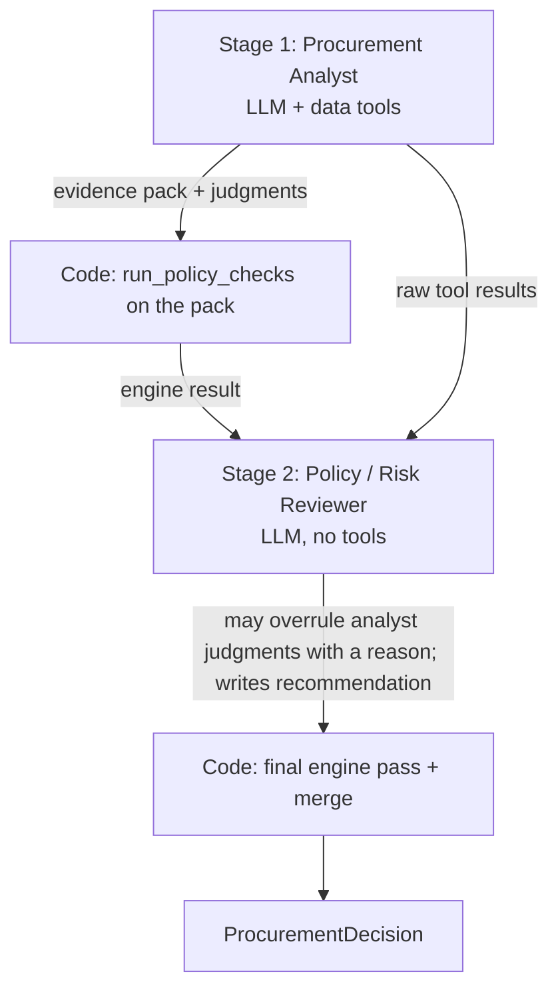

# Architecture

Design principle from the brief: **AI interprets and recommends, CODE applies thresholds and deterministic checks, HUMANS approve.**

## Data flow (both architectures)

## Architecture A: single agent

## Architecture B: staged, two agents

Same model, same tools, same engine and same merge rule in both; only the orchestration differs.

## Tools

| Tool | Kind | Purpose | Failure behaviour |
|---|---|---|---|
| `get_request_context` | data | request, requester, department budget, department head | unknown id -> `{error}` |
| `find_existing_software` | data (deterministic matching) | catalog candidates (same product / vendor / category) and purchase history | - |
| `get_vendor_status` | data | registry row plus vendor-risk API as a typed result | 404 -> `not_found`; 5xx/timeout/connection -> `unavailable`; never raises |
| `run_policy_checks` | **deterministic (code)** | required fields, budget, thresholds, 365-day expiry, security/privacy/legal triggers, conflicts, injection heuristics | pure function |
| `lookup_policy` | data | policy section text for citations | unknown section -> list of sections |

No tool can purchase, approve, change a budget or accept terms.

## Who decides what

| Decision | AI | CODE | HUMAN |
|---|:-:|:-:|:-:|
| Required fields present, missing-information list | | x | |
| Budget sufficient? | | x | |
| Approval chain from annual amount | | x | |
| Review current (<= 365 days at 2026-09-30)? | | x | |
| Security / Privacy / Legal triggers | | x | |
| Registry vs API conflict, API failure handling | | x | |
| Injection detection | second opinion | x (heuristics, all text fields) | |
| Does an existing tool credibly cover the need? | x (may clear the default flag with a stated reason) | default = flag | |
| Material legal / cross-region issue not otherwise captured | x | partly (cross-region PII rule) | |
| Recommendation and next-step wording | x (replaced if it claims approval) | template fallback | |
| Evidence items | notes only | x (built from tool outputs; grounding validator) | |
| Final approval, exceptions, budget changes, purchase | | | x |

## Merge rule and failure modes

* `required_approvals`, `risk_flags`, `missing_information`, `next_action_class` always come from the engine. Whatever the model says about them is ignored.
* The model can only (a) clear the overlap flag with a non-empty reason, (b) report an injection or a legal issue (which only add flags/approvals), and (c) write prose.
* Tool the model skipped -> code runs it (counted as a code-initiated tool call).
* Vendor API down/404 -> degraded mode, Security added, `escalate_manual`, evidence marked `[TOOL FAILURE]`.
* LLM provider down or output invalid after one repair -> deterministic decision with templated wording, `llm_unavailable` flag, human review still true.
* Model prose that claims an approval or purchase ("is approved", "auto-approve") is replaced by the template and counted.
